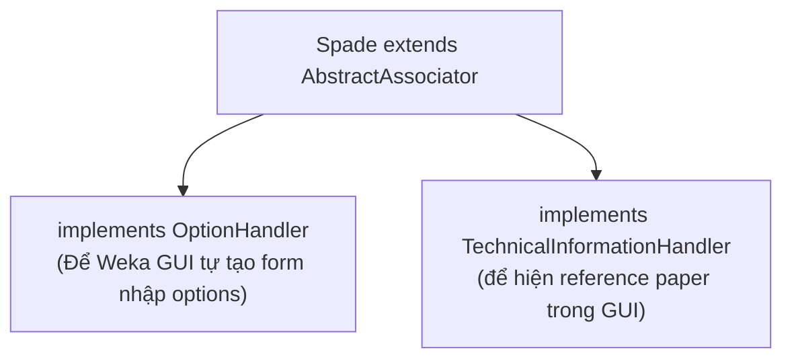
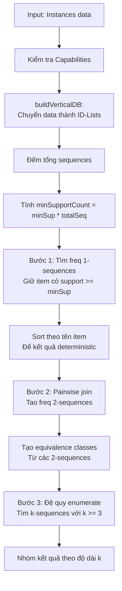

# Spade.java — Class Chính (Giải thích Logic)

> `Spade.java` là class chính kết nối thuật toán SPADE với framework Weka. File này dài 751 dòng, nhưng logic cốt lõi chỉ nằm ở 2 method: `buildAssociations()` và `buildVerticalDB()`.

---

## Tại sao cần class này?

Weka yêu cầu mọi thuật toán association phải **kế thừa** `AbstractAssociator`. Class này cung cấp:

- Method `buildAssociations(Instances data)` — entry point chạy thuật toán
- Giao diện GUI tự động từ `OptionHandler`
- Kiểm tra dữ liệu input qua `Capabilities`

---

## Cấu trúc Class



### Các thuộc tính quan trọng

| Thuộc tính            | Kiểu  | Mặc định | Ý nghĩa                                                |
| ----------------------- | ------ | ----------- | -------------------------------------------------------- |
| `m_MinSupport`        | double | 0.5         | Ngưỡng support tối thiểu (0 đến 1)                 |
| `m_DataSeqID`         | int    | 0           | Cột nào chứa Sequence ID (0-based nội bộ)           |
| `m_MaxPatternLength`  | int    | 10          | Giới hạn độ dài pattern tránh tràn bộ nhớ       |
| `m_FrequentSequences` | Map    | null        | Kết quả: map từ độ dài k → danh sách k-sequences |
| `m_TotalSequences`    | int    | 0           | Tổng số chuỗi distinct trong data                     |

### Options (tham số dòng lệnh / GUI)

| Flag   | Ví dụ    | Ý nghĩa                        |
| ------ | ---------- | -------------------------------- |
| `-D` | `-D`     | Bật debug mode                  |
| `-S` | `-S 0.3` | Đặt min support = 30%          |
| `-I` | `-I 1`   | Cột 1 (1-based) là Sequence ID |

> **Chú ý:** GUI dùng số **1-based** (cột 1, 2, 3...), nhưng nội bộ Java dùng **0-based**. Vì vậy `getDataSeqID()` trả về `m_DataSeqID + 1` và `setDataSeqID(value)` lưu `value - 1`.

---

## Capabilities — Khai báo dữ liệu hỗ trợ

```java
result.enable(Capability.NOMINAL_ATTRIBUTES);     // Thuộc tính phân loại (VD: màu = đỏ/xanh)
result.enable(Capability.NUMERIC_ATTRIBUTES);      // Thuộc tính số (VD: giá = 100)
result.enable(Capability.RELATIONAL_ATTRIBUTES);   // Thuộc tính lồng nhau (Weka-native sequence)
result.enable(Capability.MISSING_VALUES);           // Cho phép giá trị thiếu
result.enable(Capability.NO_CLASS);                 // Không cần cột class (unsupervised)
result.setMinimumNumberInstances(0);               // Chấp nhận data rỗng
```

**Tại sao cần `RELATIONAL_ATTRIBUTES`?** Vì SPADE hỗ trợ 2 format dữ liệu (xem bên dưới).

---

## 2 Format Dữ Liệu Input

SPADE hỗ trợ 2 cách tổ chức dữ liệu:

### Format 1: Flat (horizontal)

Mỗi dòng = 1 event, cột đầu tiên = ID chuỗi.

```
SeqID | Item1 | Item2
  1   |   A   |   X
  1   |   B   |   Y     ← Chuỗi 1 có 2 events
  2   |   A   |   X     ← Chuỗi 2 có 1 event
```

### Format 2: Relational (Weka-native)

Mỗi instance ở tầng trên = 1 chuỗi. Thuộc tính relational chứa các events.

```
Instance 0: Events = [{A,X}, {B,Y}]    ← Chuỗi 0
Instance 1: Events = [{A,X}]           ← Chuỗi 1
```

### So sánh xử lý trong `buildVerticalDB()`

|                               | Flat                                 | Relational                    |
| ----------------------------- | ------------------------------------ | ----------------------------- |
| **SID lấy từ đâu?** | Giá trị cột SeqID                 | Index của top-level instance |
| **EID lấy từ đâu?** | Counter tự tăng mỗi row cùng SID | Index trong relational data   |
| **Bỏ qua cột nào?**  | Cột SeqID (không mine nó)         | Không cần bỏ qua           |
| **Tổng sequences?**    | Đếm giá trị SeqID distinct       | `data.numInstances()`       |

---

## Flow chính: `buildAssociations()`



### Chi tiết từng bước

#### Bước 1: Tìm frequent 1-sequences

```
Vertical DB sau khi build:
  "BanhMi" → IdList: (0,0), (1,0), (2,0)  → support = 3
  "Sua"    → IdList: (0,1), (1,1)          → support = 2
  "Trung"  → IdList: (0,2)                 → support = 1

Nếu minSupport = 0.5 và totalSeq = 3 → minSupportCount = 2

Frequent 1-sequences:
  <{BanhMi}>  support = 3  ✅ (>= 2)
  <{Sua}>     support = 2  ✅ (>= 2)
  <{Trung}>   support = 1  ❌ (< 2)  → loại bỏ
```

#### Bước 2: Join tạo 2-sequences

Với mỗi cặp (si, sj) từ freq 1-sequences, thực hiện 3 loại join:

```
si = <{BanhMi}>,  sj = <{Sua}>

1. Temporal join si→sj: BanhMi xảy ra trước Sua?
   → <{BanhMi},{Sua}>  support = ?

2. Reverse join sj→si: Sua xảy ra trước BanhMi?
   → <{Sua},{BanhMi}>  support = ?

3. Equality join (chỉ khi i<j): BanhMi VÀ Sua cùng event?
   → <{BanhMi,Sua}>    support = ?
```

#### Bước 3: Đệ quy qua Equivalence Classes

Mỗi equivalence class chứa các 2-sequence có cùng prefix. Gọi đệ quy `enumerateFrequentSequences()` để tìm 3-sequences, 4-sequences, ...

---

## Helper Methods

### `getFrequentSequences()` — Lấy tất cả kết quả

Gộp tất cả values trong `m_FrequentSequences` (map) thành 1 list phẳng.

### `getSupport(Sequence s)` — Tìm support của 1 sequence

Logic lookup:

1. Duyệt qua `m_FrequentSequences` → tìm sequence `equals(s)` → trả về `idList.getSupport()`
2. Nếu không tìm thấy trong kết quả → fallback: dùng IdList của chính `s`
3. Cuối cùng: trả về 0

> **Tại sao dùng `equals()`?** Vì object `s` truyền vào test có thể khác object trong kết quả mining, nhưng **nội dung giống nhau** (cùng Elements, cùng Items).

### `toString()` — Hiển thị kết quả

Format output:

```
SPADE - Sequential PAttern Discovery using Equivalence classes
===============================================================

Minimum support: 0.5 (10 sequences)
Total data sequences: 20
Total frequent sequences found: 45
Elapsed time: 123 ms

Frequent Sequential Patterns:
-----------------------------

-- 1-sequences (count: 5)
  <{A}>   (support: 18, 90.0%)
  <{B}>   (support: 15, 75.0%)
  ...
```

---

## Tóm tắt: Spade.java làm gì?

| Phần                                         | Dòng   | Vai trò                                     |
| --------------------------------------------- | ------- | -------------------------------------------- |
| Constructor + Options                         | 1-285   | Weka integration: tham số, reset, parse CLI |
| Capabilities                                  | 292-304 | Khai báo loại data được chấp nhận     |
| `buildAssociations()`                       | 313-471 | **Flow chính:** 4 bước mining       |
| `getFrequentSequences()` / `getSupport()` | 478-519 | API cho test/external access                 |
| `buildVerticalDB()`                         | 532-607 | Chuyển data ngang → dọc                   |
| `toString()`                                | 614-648 | Format kết quả cho GUI                     |
| Bean properties                               | 650-740 | Getter/setter cho GUI Weka                   |
| `main()`                                    | 747-749 | Entry point chạy từ CLI                    |
