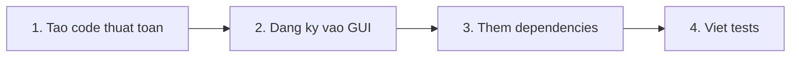
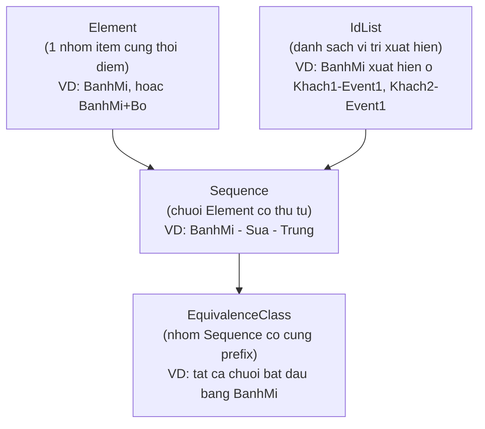
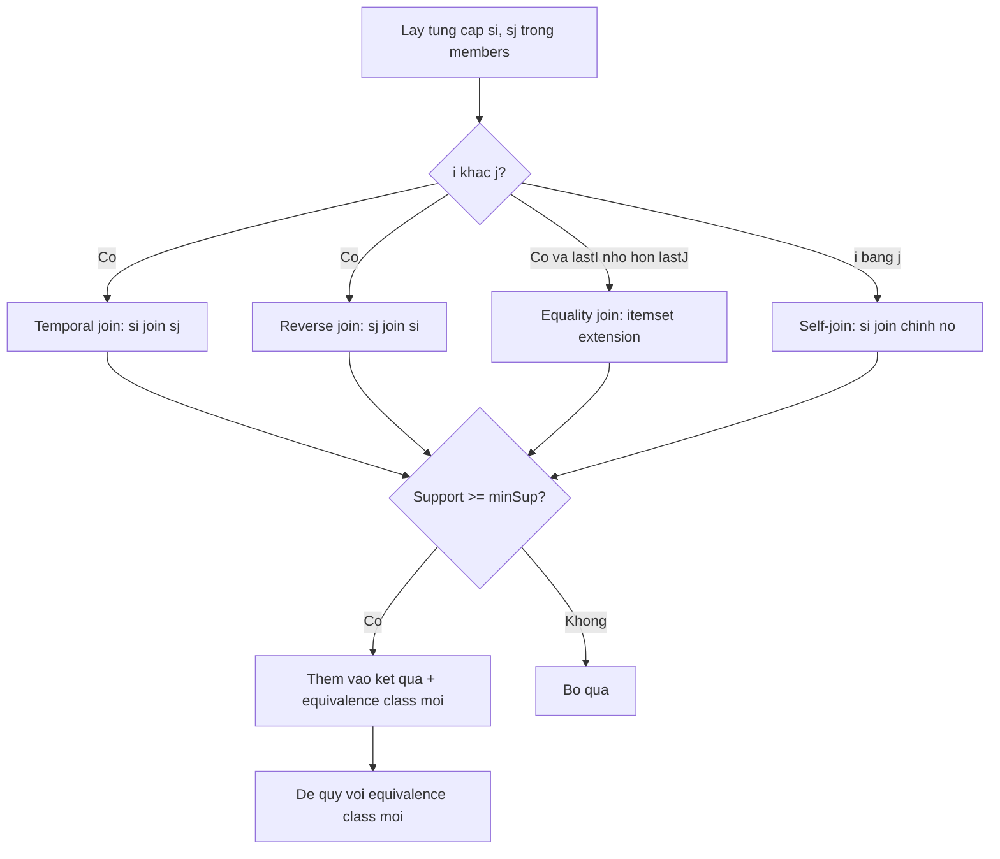
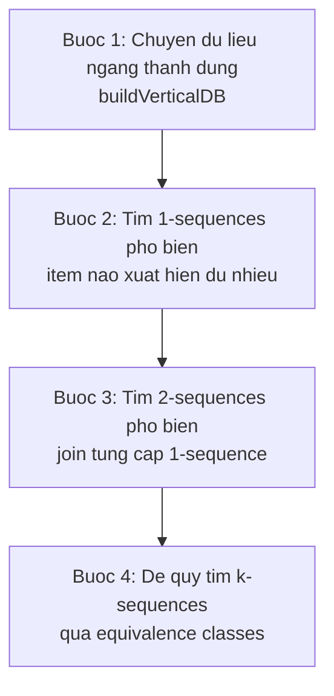

# Hướng dẫn Tích hợp SPADE vào Weka 3.9.7

> **Dành cho sinh viên** — Tài liệu giải thích từng bước cách thuật toán SPADE được thêm vào Weka, tại sao cần mỗi phần, và logic hoạt động ra sao.

---

## SPADE là gì?

**SPADE** (Sequential PAttern Discovery using Equivalence classes) là thuật toán được Mohammed J. Zaki đề xuất năm 2001 để **khai thác chuỗi phổ biến** (frequent sequential patterns).

**Ví dụ thực tế:** Trong siêu thị, khách hàng thường mua **Bánh mì → Sữa → Trứng** theo thứ tự. SPADE tìm ra các chuỗi mua hàng lặp lại nhiều nhất.

### So sánh với Apriori (đã có sẵn trong Weka)

| | Apriori | SPADE |
|---|---------|-------|
| **Tìm gì?** | Tập item xuất hiện cùng nhau (không có thứ tự) | Chuỗi item có **thứ tự thời gian** |
| **Ví dụ** | {Bánh mì, Sữa} thường mua cùng lúc | Bánh mì → Sữa → Trứng (mua theo thứ tự) |
| **Database format** | Horizontal (mỗi row = 1 transaction) | **Vertical** (mỗi item = danh sách vị trí xuất hiện) |

---

## Tổng quan: Cần thay đổi gì trong Weka?

Để thêm 1 thuật toán mới vào Weka, cần làm **4 việc**:



### Bảng tổng hợp tất cả thay đổi

| Loại | File | Vì sao cần? |
|------|------|-------------|
| **SỬA** | `pom.xml` | Thêm thư viện JUnit 5 để chạy test |
| **SỬA** | `GenericObjectEditor.props` | Đăng ký SPADE để hiện trong GUI Weka |
| **MỚI** | `Spade.java` | Class chính - thuật toán SPADE |
| **MỚI** | `spade/Element.java` | Đại diện cho 1 nhóm item cùng thời điểm |
| **MỚI** | `spade/IdList.java` | Cấu trúc dữ liệu dọc - trái tim của SPADE |
| **MỚI** | `spade/Sequence.java` | Đại diện cho 1 chuỗi có thứ tự |
| **MỚI** | `spade/EquivalenceClass.java` | Nhóm chuỗi cùng prefix để đệ quy tìm kiếm |
| **MỚI** | 8 file test + 1 file `.ref` | Đảm bảo thuật toán chạy đúng |

### Cây thư mục (chỉ hiện file liên quan)

```
weka/trunk/weka/
├── pom.xml                                    ← SỬA
├── src/main/java/weka/
│   ├── associations/
│   │   ├── Spade.java                         ← MỚI (class chính)
│   │   └── spade/                             ← MỚI (cả thư mục)
│   │       ├── Element.java
│   │       ├── EquivalenceClass.java
│   │       ├── IdList.java
│   │       └── Sequence.java
│   └── gui/
│       └── GenericObjectEditor.props          ← SỬA
└── src/test/java/weka/associations/
    ├── SpadeTest.java                         ← MỚI
    ├── SpadeFunctionalTest.java               ← MỚI (chứa SpadeTestUtils)
    ├── SpadeBoundaryTest.java                 ← MỚI
    ├── SpadeDeterminismTest.java              ← MỚI
    ├── SpadeInternalAlgorithmTest.java         ← MỚI
    ├── SpadePropertyTest.java                 ← MỚI
    ├── SpadeRegressionTest.java               ← MỚI
    └── SpadeStressTest.java                   ← MỚI
```

---

## Bước 1: Thêm JUnit 5 vào `pom.xml`

### Tại sao cần?

Weka gốc chỉ dùng **JUnit 4** (cũ). SPADE test suite dùng **JUnit 5** (mới hơn, có `@BeforeEach`, `assertThrows`, v.v.). Cần thêm 2 thư viện:

| Thư viện | Vai trò |
|----------|---------|
| `junit-jupiter-api` | Cung cấp annotation `@Test`, `@BeforeEach`, `assertEquals()` |
| `junit-jupiter-engine` | Engine để Maven nhận diện và chạy test JUnit 5 |

### Thêm gì?

Mở `pom.xml`, tìm phần `<dependencies>`, thêm **sau** dependency `junit:junit:4.13.2`:

```xml
<dependency>
  <groupId>org.junit.jupiter</groupId>
  <artifactId>junit-jupiter-api</artifactId>
  <version>5.9.3</version>
  <scope>test</scope>
</dependency>

<dependency>
  <groupId>org.junit.jupiter</groupId>
  <artifactId>junit-jupiter-engine</artifactId>
  <version>5.9.3</version>
  <scope>test</scope>
</dependency>
```

> `<scope>test</scope>` nghĩa là thư viện này chỉ dùng khi chạy test, không đóng gói vào Weka.

---

## Bước 2: Đăng ký SPADE trong GUI

### Tại sao cần?

Weka dùng file `GenericObjectEditor.props` như "danh bạ" — liệt kê tất cả thuật toán available. Nếu không thêm vào đây, SPADE sẽ **compile được** nhưng **không hiện trong GUI**.

### Thêm gì?

Mở `src/main/java/weka/gui/GenericObjectEditor.props`, tìm dòng:

```
weka.associations.Associator=\
```

Thêm `weka.associations.Spade,\` vào danh sách (giữ thứ tự ABC):

```diff
  weka.associations.PredictiveApriori,\
+ weka.associations.Spade,\
  weka.associations.Tertius
```

> Mỗi dòng kết thúc bằng `\` (trừ dòng cuối) — đây là cú pháp nối dòng trong Java properties.

---

## Bước 3: Tạo các Data Structures

### Tại sao cần package riêng `spade/`?

SPADE cần 4 cấu trúc dữ liệu đặc biệt mà Weka chưa có. Đặt trong subpackage `weka.associations.spade` để:
- Tách biệt logic nội bộ khỏi giao diện Weka
- Giữ code sạch, dễ bảo trì
- Theo convention của Weka (ví dụ: `weka.classifiers.trees` chứa helper classes)

### 3.1 — Hiểu khái niệm trước khi đọc code

Hãy tưởng tượng dữ liệu mua hàng:

```
Khách 1: Bánh mì → Sữa → Trứng
Khách 2: Bánh mì → Trứng
Khách 3: Sữa → Bánh mì → Trứng
```

SPADE biểu diễn dữ liệu này qua 4 khái niệm:



### 3.2 — Element.java — "Nhóm item cùng thời điểm"

**Vai trò:** Đại diện cho 1 hoặc nhiều item xảy ra **đồng thời** (cùng event).

**Ví dụ thực tế:**
- Mua **chỉ Bánh mì** → Element chứa 1 item: `{BanhMi}`
- Mua **Bánh mì VÀ Bơ cùng lúc** → Element chứa 2 items: `{BanhMi, Bo}`

**Logic quan trọng:**

| Method | Làm gì | Tại sao cần |
|--------|--------|-------------|
| `addItem(item)` | Thêm item + **sort lại** | Đảm bảo `{A,B}` luôn == `{B,A}` (thứ tự không quan trọng trong cùng event) |
| `equals()` | So sánh 2 Element | Dùng để check trùng lặp pattern |
| `hashCode()` | Tạo hash từ items | Cần cho `HashSet<Sequence>` hoạt động đúng |
| `copy()` | Tạo bản sao | Khi mở rộng sequence, ta copy rồi thêm chứ không sửa bản gốc |

**Điểm mấu chốt:** Items trong Element luôn được **sort**. Nếu không sort, `{B,A}` sẽ khác `{A,B}` → thuật toán đếm sai.

---

### 3.3 — IdList.java — "Trái tim của SPADE"

**Vai trò:** Lưu trữ VỊ TRÍ xuất hiện của 1 pattern dưới dạng danh sách cặp `(SID, EID)`.

- **SID** = Sequence ID (ID khách hàng / ID chuỗi)
- **EID** = Event ID (thứ tự sự kiện trong chuỗi đó)

**Ví dụ minh họa:**

```
DỮ LIỆU:
  Khách 0: [Sữa] → [BánhMì] → [Trứng]
  Khách 1: [BánhMì] → [Sữa]
  Khách 2: [BánhMì] → [Trứng]

ID-LIST CỦA "BánhMì":
  (SID=0, EID=1)    ← Khách 0, event thứ 1
  (SID=1, EID=0)    ← Khách 1, event thứ 0
  (SID=2, EID=0)    ← Khách 2, event thứ 0

→ Support = 3 (xuất hiện ở 3 SID khác nhau)
```

**3 method quan trọng nhất:**

#### `getSupport()` — Đếm support

```java
public int getSupport() {
    Set<Integer> distinctSids = new HashSet<Integer>(m_SidList);
    return distinctSids.size();  // Chỉ đếm SID khác nhau!
}
```

> **Tại sao dùng Set?** Vì 1 item có thể xuất hiện nhiều lần trong cùng 1 chuỗi. Ví dụ: Khách mua BánhMì 3 lần → vẫn chỉ đếm support = 1 cho khách đó.

#### `equalityJoin()` — Tìm item xảy ra **cùng lúc**

Dùng khi muốn tìm pattern như `{A, B}` (A và B cùng event).

```
IdList của A: (0,0), (0,2), (1,0)
IdList của B: (0,0), (1,1), (1,0)

equalityJoin → kết quả: (0,0), (1,0)
                         ↑ SID=0,EID=0 khớp cả A và B
                                   ↑ SID=1,EID=0 khớp cả A và B
```

**Logic:** Scan merge 2 danh sách đã sort → giữ cặp (SID, EID) trùng nhau.

#### `temporalJoin()` — Tìm item xảy ra **sau**

Dùng khi muốn tìm pattern `A → B` (B xảy ra SAU A).

```
IdList của A: (0,0), (0,2), (1,0)
IdList của B: (0,1), (0,3), (1,1)

temporalJoin(A, B) → kết quả: (0,1), (0,3), (1,1)
                               ↑ B ở EID=1 > A ở EID=0 (min)
                                      ↑ B ở EID=3 > A ở EID=0 (min)
                                             ↑ B ở EID=1 > A ở EID=0
```

**Logic:** Với mỗi SID chung, tìm **EID nhỏ nhất** của A, rồi lấy tất cả entry B có EID lớn hơn.

> **Tại sao lấy min EID?** Vì SPADE tìm pattern "A xảy ra trước B" — chỉ cần A xuất hiện ít nhất 1 lần trước B.

---

### 3.4 — Sequence.java — "Chuỗi có thứ tự"

**Vai trò:** Một chuỗi sự kiện có thứ tự, là kết quả output chính của SPADE.

**Cấu trúc:** Sequence = danh sách Element có thứ tự

```
Ví dụ: <{A,B}, {C}, {D}>
        ↑       ↑    ↑
        Event 1  Event 2  Event 3
        (A và B  (chỉ C)  (chỉ D)
        cùng lúc)
```

**2 cách mở rộng chuỗi (cực kỳ quan trọng!):**

| Loại | Method | Ý nghĩa | Ví dụ |
|------|--------|---------|-------|
| **Sequence extension** | `sequenceExtend("D")` | Thêm item như event MỚI ở cuối | `<{A},{B}>` → `<{A},{B},{D}>` |
| **Itemset extension** | `itemsetExtend("D")` | Thêm item VÀO event cuối cùng | `<{A},{B}>` → `<{A},{B,D}>` |

> **Tại sao phân biệt?** Vì `<{A},{B,D}>` (B và D cùng lúc) KHÁC `<{A},{B},{D}>` (B rồi D). Đây là điểm khác biệt lớn giữa sequential pattern mining và itemset mining.

**Các method hỗ trợ:**

| Method | Vai trò |
|--------|---------|
| `itemCount()` | Tổng số item (k trong k-sequence). `<{A,B},{C}>` → 3 |
| `getLastItem()` | Item cuối cùng — dùng để xác định atom trong equivalence class |
| `isSequenceExtension()` | Element cuối có 1 item VÀ sequence dài >1 → đây là sequence extension |
| `copy()` | Tạo bản sao sâu Elements, shallow copy IdList (vì IdList không bị sửa) |

---

### 3.5 — EquivalenceClass.java — "Nhóm cùng prefix"

**Vai trò:** Phân chia không gian tìm kiếm thành các nhóm độc lập → giảm tính toán.

**Ý tưởng:** Tất cả chuỗi bắt đầu bằng `<{A}>` được nhóm lại. Trong nhóm đó, ta chỉ cần join các thành viên với nhau, không cần xét chuỗi ngoài nhóm.

```
Prefix: <{A}>
Members:
  <{A},{B}>     ← A rồi B
  <{A},{C}>     ← A rồi C  
  <{A,D}>       ← A cùng lúc D

Từ nhóm này sinh ra:
  <{A},{B},{C}> ← join <{A},{B}> với <{A},{C}> (temporal)
  <{A},{C},{B}> ← join ngược
  <{A},{B,C}>   ← join bằng (itemset extension)
```

**Logic đệ quy `enumerateFrequentSequences()`:**



**3 loại join cho mỗi cặp:**

| Case | Điều kiện | Join | Kết quả | Ví dụ |
|------|-----------|------|---------|-------|
| 1a | `i != j` | `si.temporalJoin(sj)` | si rồi sj | `<A,B>` + `<A,C>` → `<A,B,C>` |
| 1b | `i != j` | `sj.temporalJoin(si)` (ngược) | sj rồi si | `<A,B>` + `<A,C>` → `<A,C,B>` |
| 2 | `i != j` và `lastI < lastJ` | `equalityJoin` | si cùng sj | `<A,B>` + `<A,C>` → `<A,{B,C}>` |
| 3 | `i == j` | `si.temporalJoin(si)` (tự join) | item lặp | `<A,B>` → `<A,B,B>` |

> **Tại sao cần `maxPatternLength`?** Không giới hạn thì với dữ liệu dày, chuỗi có thể dài vô hạn → **tràn bộ nhớ**. Mặc định giới hạn k=10.

---

## Bước 4: Tạo Class Chính — Spade.java

Xem file chi tiết: [spade_main_class.md](./spade_main_class.md)

**Tóm tắt:** `Spade.java` kế thừa `AbstractAssociator` của Weka và implement flow 4 bước:



---

## Bước 5: Tạo Test Files

Xem file chi tiết: [spade_test_files.md](./spade_test_files.md)

### Tại sao cần nhiều loại test?

| Loại test | Kiểm tra gì | Ví dụ |
|-----------|-------------|-------|
| **SpadeTest** | Weka integration | Chạy được với framework kiểm thử Weka chuẩn |
| **Functional** | Kết quả mining đúng | Input A→B, output có chứa pattern A→B |
| **Boundary** | Trường hợp biên | Dataset rỗng, chỉ 1 item, minSup = 0 hoặc 1 |
| **Internal** | Logic join đúng | Equality join khác temporal join |
| **Determinism** | Kết quả ổn định | Chạy 10 lần cùng data → cùng kết quả |
| **Property** | Tính chất toán học | Anti-monotonicity: parent support >= child support |
| **Regression** | Không có bug cũ | SeqID không bị mine như item |
| **Stress** | Hiệu năng | 1000 sequences không crash |

---

## Bước 6: Build & Chạy

```bash
# Compile
mvn compile

# Chạy tất cả test
mvn test

# Chạy chỉ SPADE test  
mvn test -Dtest="weka.associations.Spade*Test"

# Build JAR (bỏ qua test)
mvn package -P no-tests
```

---

## Tóm tắt — Checklist tái tạo

| # | Việc cần làm | File |
|---|-------------|------|
| 1 | Thêm JUnit 5 dependencies | `pom.xml` |
| 2 | Tạo `Element.java` | `associations/spade/` |
| 3 | Tạo `IdList.java` | `associations/spade/` |
| 4 | Tạo `Sequence.java` | `associations/spade/` |
| 5 | Tạo `EquivalenceClass.java` | `associations/spade/` |
| 6 | Tạo `Spade.java` | `associations/` |
| 7 | Đăng ký GUI | `GenericObjectEditor.props` |
| 8 | Tạo 8 test files + 1 ref | `test/associations/` |
| 9 | Build & verify | `mvn test` |
