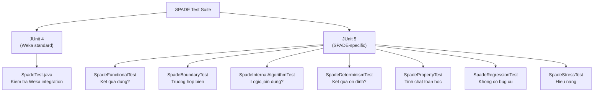
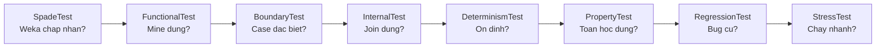

# SPADE Test Files — Giải thích Logic

> Tài liệu giải thích **tại sao** cần mỗi loại test và **logic** kiểm tra gì, thay vì chỉ show code.

---

## Tổng quan Test Suite

SPADE có **8 test class** + 1 file reference, chia thành 2 nhóm:



---

## SpadeTestUtils — Class tiện ích chia sẻ

> Được định nghĩa trong `SpadeFunctionalTest.java`, dùng chung bởi tất cả test class.

### Tại sao cần?

Mỗi test cần tạo dataset, chạy mining, so sánh kết quả. Nếu copy-paste thì rất dài và khó sửa. `SpadeTestUtils` gom các thao tác lặp lại.

### Các method chính

| Method | Input | Output | Làm gì |
|--------|-------|--------|--------|
| `createRelationalDataset({"A","B"})` | Mảng tên item | `Instances` rỗng | Tạo dataset relational với attribute cho mỗi item |
| `addRelationalEvent(data, 0, {0,1})` | Dataset, seq index, item indices | void | Thêm 1 event (item 0 và 1) vào sequence 0 |
| `mine(spade, data, 0.5)` | Spade, data, minSup | `Set<Sequence>` | Chạy SPADE và trả về tập pattern |
| `seq("A", "B")` | Tên items | `Sequence` | Tạo sequence `<{A},{B}>` |
| `itemsetSeq("A", "B")` | Tên items | `Sequence` | Tạo sequence `<{A,B}>` (cùng event) |
| `itemStr("A")` | Tên item | `"ItemA=1"` | Convert tên item thành format Weka |
| `assertPatternSetEquals(exp, act)` | 2 Sets | void | So sánh 2 tập pattern, báo lỗi chi tiết |

> **Tại sao dùng `Set<Sequence>`?** Vì thứ tự pattern không quan trọng — chỉ cần biết pattern CÓ hoặc KHÔNG có trong kết quả.

---

## 1. SpadeTest.java — Weka Integration

### Kiểm tra gì?

Extends `AbstractAssociatorTest` của Weka → tự động test:
- Serialize/deserialize (lưu/load model)
- Chạy trên dataset mẫu của Weka
- So sánh output với file `SpadeTest.ref`

### Tại sao cần?

Mọi Weka associator **bắt buộc** phải pass `AbstractAssociatorTest`. Nếu không, Weka reject thuật toán.

### SpadeTest.ref là gì?

File text chứa output **mẫu** khi chạy SPADE trên dataset test mặc định của Weka. `AbstractAssociatorTest` so sánh output thực tế với file này — nếu khác → FAIL.

---

## 2. SpadeFunctionalTest — Kết quả đúng không?

### 3 test cases

| Test | Setup | Kiểm tra |
|------|-------|----------|
| `test1SequenceMining` | 2 sequences: Seq0=[A→B], Seq1=[A→C] | Tìm được 5 pattern (A, B, C, A→B, A→C), support A=2 |
| `test2SequenceMining` | 3 seqs: [A→B], [A→B], [B→A]. minSup=66% | A→B có support 2/3 ✅, B→A chỉ 1/3 ❌ |
| `testKSequenceMining` | 3 seqs identical [A→B→C→D→E] + 1 noise. minSup=75% | Tìm được full 5-sequence, support=3 |

### Logic test1 chi tiết

```
Input:
  Seq 0: Event0=[A], Event1=[B]
  Seq 1: Event0=[A], Event1=[C]

Expected patterns:
  <{ItemA=1}>           support=2 (ca 2 seq co A)
  <{ItemB=1}>           support=1 (chi seq 0)
  <{ItemC=1}>           support=1 (chi seq 1)
  <{ItemA=1},{ItemB=1}> support=1 (A roi B, chi seq 0)
  <{ItemA=1},{ItemC=1}> support=1 (A roi C, chi seq 1)

Verify:
  1. actual.size() == 5
  2. Moi pattern trong expected phai co trong actual
  3. Support cua A == 2, cac pattern khac support == 1
```

---

## 3. SpadeBoundaryTest — Trường hợp đặc biệt

| Test | Input | Expected | Kiểm tra vấn đề gì |
|------|-------|----------|---------------------|
| `testEmptyDataset` | 0 sequences | 0 patterns | Không crash với data rỗng |
| `testDatasetWithOneSequence` | 1 seq: [A→B] | A, B, A→B | Hoạt động với 1 chuỗi duy nhất |
| `testDatasetWithOneItem` | 2 seqs, chỉ item A | Chỉ `<{A}>`, support=2 | Không tạo pattern giả |
| `testDatasetNoItemMeetsMinSup` | 3 seqs, mỗi seq 1 item khác | 0 patterns | Pruning đúng khi không item nào frequent |
| `testMinSupZero` | 1 seq, minSup=0 | `<{A}>`, support=1 | minSup=0 không crash, minSupportCount tối thiểu=1 |
| `testMinSupOne` | 3 seqs, A chỉ ở 2/3. minSup=100% | 0 patterns | 100% support = phải có ở TẤT CẢ sequences |

---

## 4. SpadeInternalAlgorithmTest — Logic nội bộ

### Test quan trọng nhất: `testEqualityVsTemporalJoin`

```
Input: 2 sequences, moi seq co A va B xuat hien CUNG 1 EVENT

  Seq 0: Event0=[A, B]    (A va B cung luc)
  Seq 1: Event0=[A, B]

Ket qua DUNG:
  <{ItemA=1, ItemB=1}>  ✅ Itemset (cung luc)

Ket qua SAI (neu co):
  <{ItemA=1},{ItemB=1}>  ❌ A roi B (temporal) - SAI vi chung cung event!
  <{ItemB=1},{ItemA=1}>  ❌ B roi A (temporal) - SAI vi chung cung event!
```

**Ý nghĩa:** Temporal join chỉ trả kết quả khi EID khác nhau. Equality join trả kết quả khi EID giống nhau. Nếu lẫn lộn → kết quả sai.

### `testAntiDoubleCount`

```
Seq 0: [A], [A], [A]   (A xuat hien 3 lan)
Seq 1: [A]              (A xuat hien 1 lan)

Support cua A PHAI = 2 (2 SID), KHONG PHAI 4 (tong entries)
```

---

## 5. SpadeDeterminismTest — Kết quả ổn định

### Logic

```
1. Tao 4 logical sequences
2. Lap 10 lan:
   a. Shuffle thu tu sequences (dung Random seed=100)
   b. Tao dataset moi tu thu tu da shuffle
   c. Chay SPADE
   d. So sanh ket qua voi lan chay dau tien
3. Neu bat ky lan nao khac → FAIL
```

**Tại sao cần?** Nếu thuật toán dùng HashMap không deterministic hoặc sort không ổn định → kết quả thay đổi mỗi lần chạy → không tin cậy.

---

## 6. SpadePropertyTest — Tính chất toán học

### Anti-monotonicity (tính chất quan trọng nhất của pattern mining)

**Quy tắc:** Nếu chuỗi CON có support = x, thì mọi chuỗi CHA (prefix ngắn hơn) phải có support ≥ x.

```
Vi du:
  <{A},{B},{C}>  support = 5
  <{A},{B}>      support PHAI >= 5  (vi A→B la prefix cua A→B→C)
  <{A}>          support PHAI >= 5
```

**Cách test:** Tạo 20 sequences ngẫu nhiên → mine → duyệt mỗi pattern → kiểm tra prefix có support cao hơn.

---

## 7. SpadeRegressionTest — Phòng bug cũ

Dùng **flat format** (khác các test khác dùng relational).

| Test | Bug cần phòng | Cách verify |
|------|---------------|-------------|
| `testEventIDNotTreatedAsItem` | Cột SeqID bị mine như item | Output không chứa "SeqID=" |
| `testSupportDoesNotDoubleCount` | 3 event cùng SID đếm support=3 | Output chứa "support: 2" |
| `testJoinDoesNotProduceInvalid` | A và B cùng event bị tạo A→B | Output không chứa temporal pattern |
| `testDeterministicOutput` | 2 lần chạy cho output khác | `firstRun.equals(secondRun)` |

---

## 8. SpadeStressTest — Hiệu năng

| Test | Scale | Kiểm tra |
|------|-------|----------|
| `testDeepPattern` | 10 seqs × 6 items = 63 patterns | Đếm chính xác 2^6 - 1 = 63 temporal subsequences |
| `testSparseDataset` | **1000 sequences** | A→B support = 500 chính xác |
| `testDenseExplosion` | 20 seqs × 3 events × 3 items/event | Không crash OOM nhờ `maxPatternLength` |

### Tại sao 63 patterns?

Với 6 items theo thứ tự cố định, mọi subset (giữ thứ tự) đều là 1 valid pattern:

```
Chon 1 tu 6: C(6,1) = 6
Chon 2 tu 6: C(6,2) = 15
Chon 3 tu 6: C(6,3) = 20
Chon 4 tu 6: C(6,4) = 15
Chon 5 tu 6: C(6,5) = 6
Chon 6 tu 6: C(6,6) = 1
Tong: 6 + 15 + 20 + 15 + 6 + 1 = 63
```

---

## Tóm tắt: Mỗi test kiểm tra điều gì?



> **Logic tong the:** Test đi từ cơ bản (chạy được?) → chức năng (đúng?) → edge case (đặc biệt?) → thuộc tính (toán học?) → hiệu năng (nhanh?)
